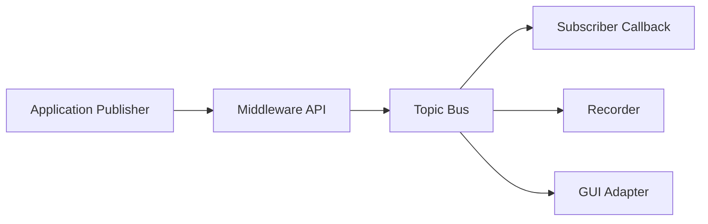

# Custom Middleware GP

A from-scratch C++17 publish/subscribe middleware for learning, robotics, simulation, and sensor applications.

The project begins with a small in-process middleware and grows one verified feature at a time. A simulated 2D LiDAR will be the first complete application. A SICK picoScan150 Ethernet adapter will be added only after the middleware interfaces are stable.

## Learning method

For every feature:

1. Understand the responsibility and data flow.
2. Design the public interface.
3. Write a small portion manually.
4. Explain every line.
5. Compile and test it.
6. Compare at least one alternative design.
7. Commit the verified step before continuing.

Implementation code is not generated as a finished solution. The learner writes each part with guided review.

## Initial technical baseline

- Language: C++17
- Primary platform: Ubuntu Linux
- Future deployment: NVIDIA Jetson AGX Orin
- Initial communication: in-process publish/subscribe
- Later transports: ZeroMQ/TCP and UDP
- Initial tests: small executable tests, followed by GoogleTest
- Future storage: SQLite plus binary scan data
- Future sensor: SICK picoScan150 2D LiDAR

## Planned data flow

## Development stages

1. Project skeleton and build verification
2. Message representation
3. Publisher interface
4. Subscriber callback
5. In-memory topic bus
6. Message queues and event loop
7. Thread safety and shutdown
8. Serialization
9. Transport abstraction
10. ZeroMQ/TCP transport
11. UDP transport
12. Recorder and playback
13. Simulated 2D LiDAR
14. GUI-facing library
15. SICK picoScan150 Ethernet adapter

See [docs/ROADMAP.md](docs/ROADMAP.md) for acceptance criteria and [docs/ARCHITECTURE.md](docs/ARCHITECTURE.md) for the evolving design.

## Current milestone

**Step 0 — Repository foundation**

No middleware implementation has been added yet. The next learning step is to create and understand the top-level CMake build file.
