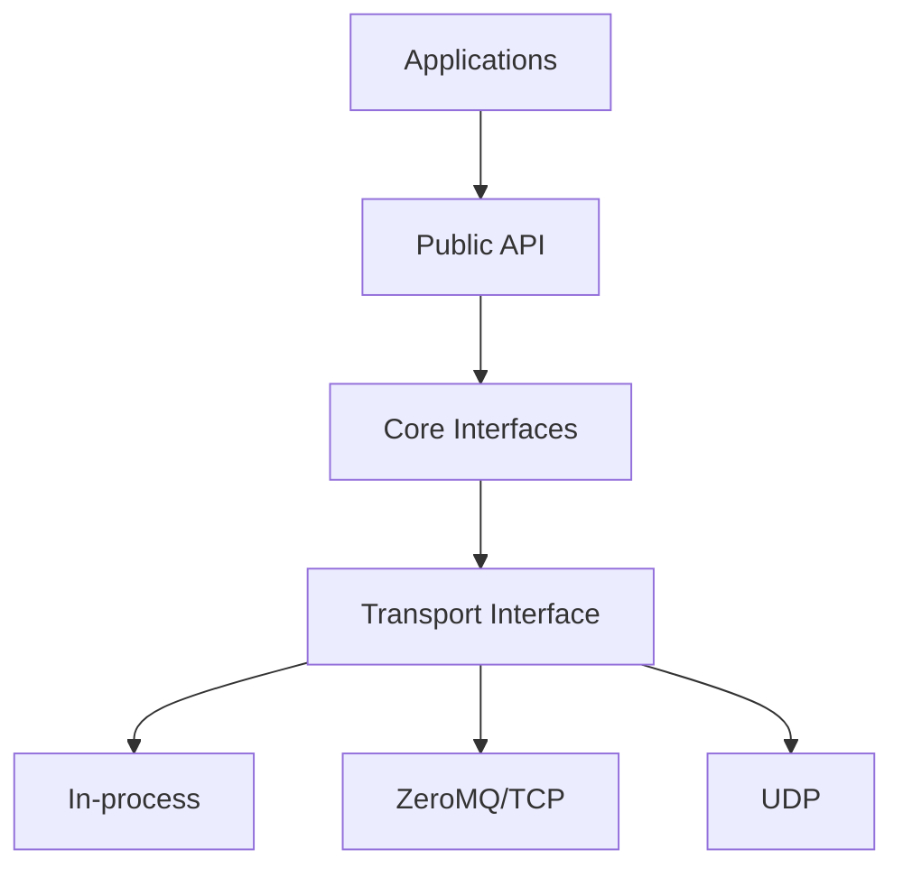

# Architecture

This document describes responsibilities and boundaries. It will be updated only after a learning milestone is implemented and verified.

## Design goals

- A small API that beginner application developers can understand.
- Separation between application code and transport code.
- Deterministic ownership and shutdown.
- Bounded memory use.
- Detectable message loss through sequence numbers.
- Testable components with minimal global state.
- Compatibility with desktop Linux and Jetson deployment.
- Sensor-independent public messages.

## Initial layers

| Layer | Responsibility |
|---|---|
| Application | Sensor, controller, recorder, playback or GUI program |
| Public API | Node, publisher, subscriber and message-facing types |
| Core | Topic registration, routing, queues and execution |
| Serialization | Conversion between C++ objects and bytes |
| Transport | In-process, ZeroMQ/TCP or UDP delivery |
| Platform | Threads, clocks, sockets and operating-system services |

## Dependency direction

Applications may depend on the public API. The public API must not expose ZeroMQ, UDP, SQLite, Qt, ROS or SICK types.

## Planned public concepts

These names are provisional and will be evaluated during implementation:

- `Message`
- `Node`
- `Publisher`
- `Subscriber`
- `TopicBus`
- `Executor`
- `Transport`

No public concept becomes permanent merely because it appears in this document.

## Important boundaries

### Middleware versus LiDAR

The middleware routes messages. It must not contain SICK packet parsing or ray-casting calculations.

### LiDAR source versus scan consumers

The simulated LiDAR and SICK picoScan150 adapter implement the same source-facing contract. Recorders and GUIs consume normalized scans rather than vendor packets.

### Recorder versus GUI

The recorder owns persistence. The GUI receives live or replayed messages and does not write directly into the recorder database.

## Decisions postponed intentionally

The following decisions will be made after the in-process version works:

- Brokered versus brokerless network topology
- Exact serialization format
- Discovery protocol
- QoS policy model
- Shared-memory transport
- Real-time scheduling
- Authentication and encryption
